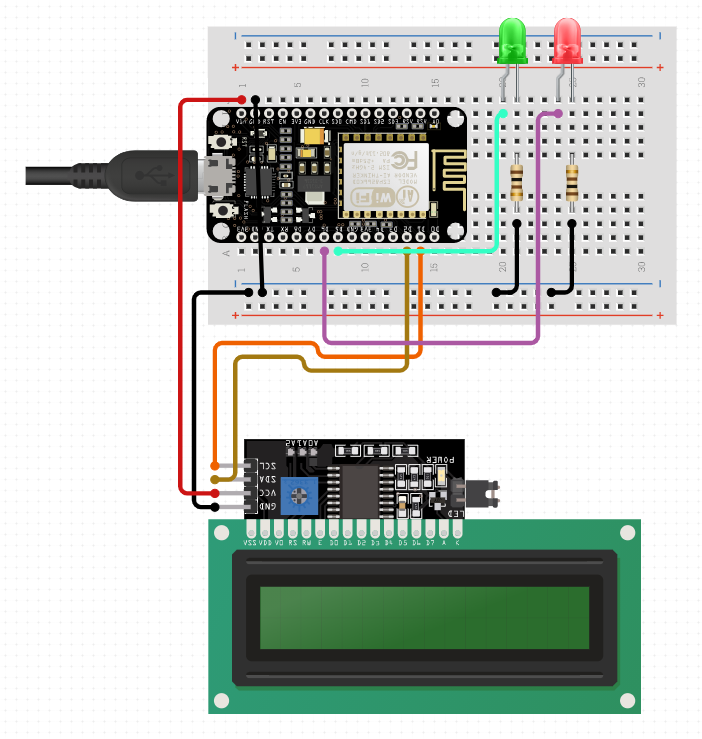

# Bitcoin Price Tracker

## Hardware Requirements

- ESP8266 (NodeMCU Lolin V3)
- 128x32 I2C OLED LCD Display
- Breadboard
- Red LED
- Green LED
- 330 ohm resistors
- Jumper wires

## Reference Circuit Schematic

## Setup Guide

- Change **ssid** to your WiFi network
- Change **password** to your WiFi password
- You may need to update the **fingerprint of coingecko API**
- You may need to change the **LED output pins**
- Upload the sketch to the NodeMCU board
